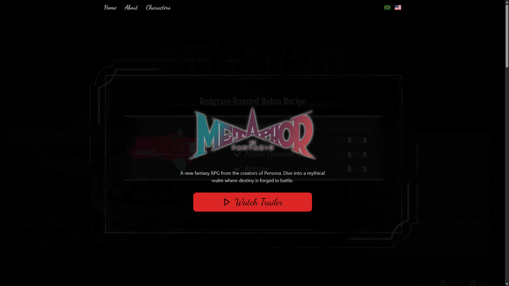
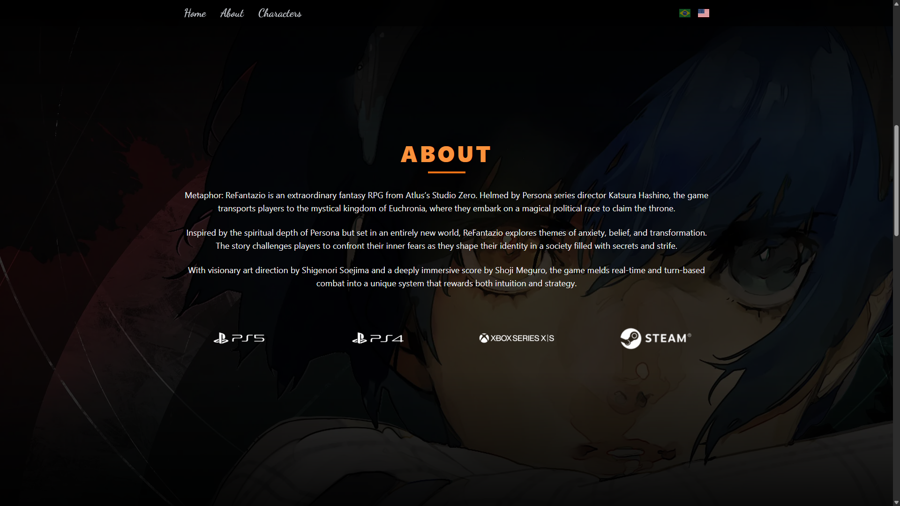
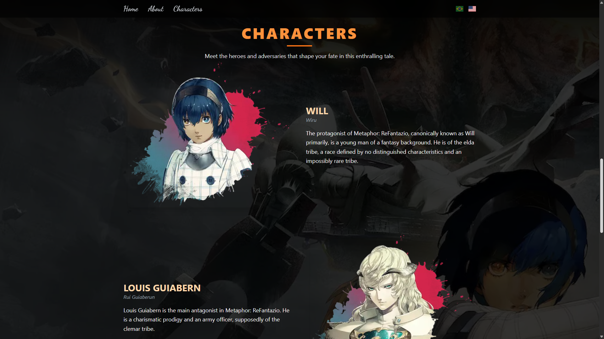

# Metaphor: ReFantazio - Fan Project

Este é um projeto de portfólio inspirado no universo de **Metaphor: ReFantazio**, criado com **Next.js**, **TailwindCSS**, **Framer Motion** e **Internacionalização (i18n)** usando o `next-i18next`.

## Hero Section


## About Section


## Characters Section


---

## 🚀 Tecnologias Utilizadas

- [Next.js](https://nextjs.org/)
- [Tailwind CSS](https://tailwindcss.com/)
- [Framer Motion](https://www.framer.com/motion/)
- [next-i18next](https://github.com/i18next/next-i18next)
- [TypeScript](https://www.typescriptlang.org/)

---

## 📁 Estrutura de Pastas

```
.
├── components/             
│   ├── AboutSection.tsx         # Seção sobre o jogo
│   ├── CharactersSection.tsx    # Seção com os personagens
│   ├── HeroSection.tsx          # Seção inicial com chamada para o trailer
│   └── ui/                      # Componentes visuais reutilizáveis (Header, Footer, etc.)
├── data/                        # Dados dos personagens
├── pages/                       # Páginas do Next.js
├── public/
│   ├── flags/                   # Bandeiras pt/en
│   ├── platforms/               # Logos das plataformas (PS5, Xbox, Steam etc.)
│   ├── screenshots/             # Screenshots usadas no README
│   └── locales/                 # Arquivos de tradução i18n (pt e en)
│       ├── en/
│       │   └── common.json
│       └── pt/
│           └── common.json
├── styles/
│   └── globals.css              # Estilos globais
├── types/                       # Tipagens TypeScript
└── utils/                       # Utilitários (ex: animações)
```

---

## 🌐 Internacionalização (i18n)

Este projeto suporta **português (pt)** e **inglês (en)**. A mudança de idioma pode ser feita clicando nas bandeiras localizadas no header (🇧🇷 🇺🇸).

- Os arquivos de tradução estão localizados em: `public/locales/pt/common.json` e `public/locales/en/common.json`.

---

## 📦 Instalação

```bash
git clone https://github.com/coqueirojoao/metaphor-landing.git
cd metaphor-landing
npm install
```

---

## 🧪 Executando o projeto localmente

```bash
npm run dev
```

Acesse: `http://localhost:3000`

---

## 🧳 Build para produção

```bash
npm run build
npm start
```

---

## 🤝 Contato

Este projeto foi desenvolvido por [João Pedro Coqueiro de Azevedo](https://www.linkedin.com/in/coqueirojoao/). Sinta-se livre para contribuir, reportar bugs ou entrar em contato!

---

## 🧾 Créditos

- Imagens, personagens e referências são propriedade da Atlus e Studio Zero.
- Este projeto é **não-comercial** e feito exclusivamente para fins educacionais e de portfólio.
